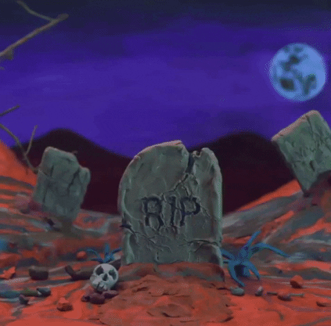

<h1 align ="center"> Hello World! Eu sou o Nicolas! 🧟‍♂️</h1>

<h4>Sobre: </h4>

Graduando em Análise e Desenvolvimento de Sistemas, formado em  
  comunicação visual pela Etec de Vila Formosa, onde pude criar projetos  
  com ferramentas de ilustração e pintura, adquiri conhecimentos técnicos  
  no pacote adobe, com ênfase em Illustrator e Photoshop.  
  Concluí o Bootcamp Java Full Stack da Generation, onde desenvolvi  
  hardskills voltadas para a Metodologia Scrum,  desenvolvimento  
  em Linguagem Java, banco de dados MySQL, utilização do  
  Framework SpringBoot e também React, Insomnia, Git /GitHub e HTML e CSS.  
  Atuei como auxiliar de processos gráficos, com criação de artes digitais 
  e identidades visuais; Onde Desenvolvi softskills que pretendo utilizar em futuras atribuições 
 em futuras atribuições tribuições profissionais como desenvolvedor Full Stack.
 
 

  
    

    

  
  

 

  

 
    
    
    
    
    
    
    
    
      

    
 

